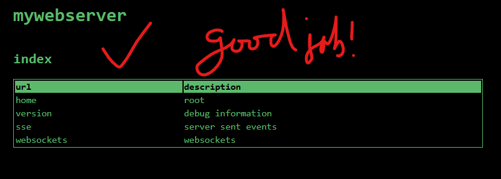

# notes



## server side events

Service side events are http native and are like a radio station broadcasting secret numbers for spies who
can't, obviously, broadcast back. This analogy falls apart a bit when you consider the client connects to 
the server and can disconnect. Don't at me...

To implement it client side, we just need some javascript to receive the message and do something with it.

The following connects to `/events` and registers `onemessage` and `onerror` where we log it. 
Additionally for `onmessage` creates and new paragraph html element with the local date and `.data`.

```javascript
const eventSource = new EventSource('/events');

eventSource.onmessage = (event) => {
  console.log('Received:', event);
  const p = document.createElement('p');
  p.textContent = `${Date.now()} => ${event.data}`;
  document.querySelector('.events').appendChild(p);
};
eventSource.onerror = (error) => {
  console.error('EventSource failed:', error);
  window.location.reload();
};

```

The Go code looks a bit busier but its pretty simple if you ignore the boilerplate:

- set some headers for our client to understand
- create a flushers on the stream, go ahead and think of a toilet - don't blame you and it works the same
- extract a context to listen to for when the client has disconnected
- go into a infinite for loop blocking for two cases
- select case of context done means the client has gone away and we should return
- select case of ticker ticking means this client won a car! inform them, flush the toilet and continue playing

```go
handler.HandleFunc("/events", func(w http.ResponseWriter, r *http.Request) {
  w.Header().Set("Content-Type", "text/event-stream")
  w.Header().Set("Cache-Control", "no-cache")
  w.Header().Set("Connection", "keep-alive")

  // check if the client supports flushing
  flusher, ok := w.(http.Flusher)
  if !ok {
    http.Error(w, "Streaming unsupported!", http.StatusInternalServerError)
    return
  }

  // get the context for this request
  ctx := r.Context()

  slog.Info("client connected", "remote", r.RemoteAddr)

  // game loop to win a car
  for {
    select {
    // if the client disconnects, we should stop sending events
    case <-ctx.Done():
      slog.Info("client disconnected", "remote", r.RemoteAddr)
      return
    // on pulse, this client gets a car!
    case <-ticker.C:
      fmt.Fprintf(w, "data: %s gets a car!\n\n", r.RemoteAddr)
      flusher.Flush()
    }
  }
})
```

## websockets

Bidirectional in nature and using its own protocol, websockets are ways for a client and 
server to continuously communicate over a `websocket` which is negotiated at connection. 

In our demo we wandered out from just using standard lib and imported the the staging 
[websocket](https://pkg.go.dev/golang.org/x/net/websocket) from [Google](https://cs.opensource.google/go/x/net). 
This was useful so we didn't need to implement the protocol itself and to address that some packages are staged there. I 
personally think these are easy to audit so I'm comfortble bringing them into projects.

Anyway, in the [source](https://cs.opensource.google/go/x/net/+/refs/tags/v0.35.0:websocket/websocket.go;l=33) 
you'll see what protocol looks like, a set of frames involving ping pong.

```go
	ContinuationFrame = 0
	TextFrame         = 1
	BinaryFrame       = 2
	CloseFrame        = 8
	PingFrame         = 9
	PongFrame         = 10
	UnknownFrame      = 255
```

Using this we can establish our own protocol on this lower protocol, typically using textFrames to exchange JSON objects 
back and forth but you can send binary too. What to do with that data and how it is structured is 100% up to you. Except 
ping/pong that is only played by the client server and useful to keep them engaged.

The following is more involed than SSE but we are

- grabing the web brower's address and converting it to a websocket url `/ws` so `http://example.com/websocket.html` would become `ws://example.com/ws` as (`wsURL`)
- create a new websocket with that `wsUrl`
- log and then register a function for `onmessage` that will insert a paragraph element with our message from `.data` Note how the data is parsed as JSON in this example, since the server is sending as JSON over the wire.
- Some logging for `onerror` and `onclose`

```javascript
// ws.js is basic websocket

const wsUrl = window.location.href.replace('http', 'ws').replace('websockets.html', 'ws');
console.log(wsUrl);

ws = new WebSocket(wsUrl);

ws.onopen = () => {
  console.log('Connected');
};

// T{Message = ""}
ws.onmessage = (event) => {
  console.log('Received:', event.data);
  const p = document.createElement('p');

  info = JSON.parse(event.data)

  p.textContent = `${Date.now()}  ${info.message}`;
  document.querySelector('.events').appendChild(p);
};

ws.onerror = (error) => {
  console.error('Error:', error);
};

ws.onclose = () => {
  console.log('Disconnected');
};
```

Let's look at the server now:

- we use the package's `websocket.Handler` to upgrade an HTTP request to websocket protocol
- define a simple structure that contains a string called `Message` with some metadata to call it `message` when converted to JSON.
- get a context (created for us or passed from the server) that informs us about the underlying network connection
- our forever game loop, we branch on select blocking for two cases
- case of  `ctx` informing us it is going away (client is gone for whatever reason) and exit the whole http request
- case of a tick from our ticker, which means this client won a car! inform them, flush and continue

```go
handler.Handle("/ws", websocket.Handler(func(ws *websocket.Conn) {
  slog.Info("websocket connected", "remote", ws.Request().RemoteAddr)
  type T struct {
    Message string `json:"message"`
  }

  ctx := ws.Request().Context()

  for {
    select {
    case <-ctx.Done():
      slog.Info("websocket disconnected", "remote", ws.Request().RemoteAddr)
      return

    case <-ticker.C:
      t := T{Message: "you win a car!"}
      err := websocket.JSON.Send(ws, t)
      if err != nil {
        slog.Error("websocket send", "error", err)
        return
      }
    }
  }
}))
```

## conclusions
Honestly, they aren't that bad really.  What and hows are harder but these two technologies alone can make your web-site a web-app.
Now go make something crazy and fun.
